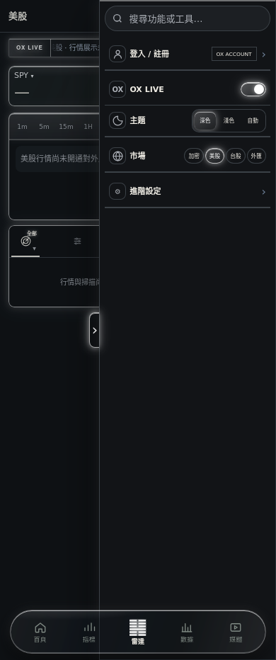
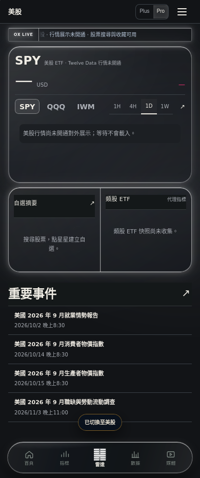

# US mobile missing-data correction — 2026-09-30

Production baseline: acddabefa6a985a12eacdc1cc06a6fb091ea13c4.

Observed production responses:
- capabilities: HTTP 200, externalDisplayConfirmed=false.
- SPY quote-v2 and chart-v2: HTTP 403, US_DATA_DISPLAY_RIGHTS_REQUIRED.
- static data/us-snapshot.json: HTTP 404.

The US interface was mounted, but real quotes and bars were blocked by the application's backend license confirmation guard. The provider's external display entitlement has not been established. This is unresolved; the screenshots below do not prove real data connectivity.

Changes:
- Keep the server authorization guard; return explicit empty snapshot state rather than request an absent static file. Never serve privateValidation snapshots.
- Stop chart polling/requests after known display denial; preserve other permission/network error reasons.
- Retain the actual chart attribution and shrink an empty chart stage to 112px. Home removes the active-chart height constraint; blocked mobile radar uses a compact chart followed by its list.
- Replace the misleading claim that search could always retrieve real quotes with accurate search/watchlist availability.
- Version changed US modules consistently; other markets' CSS is unchanged.

Verification:
- 168 unit tests and asset/id checks passed.
- Eight Chromium/WebKit startup scenarios at 390/430px passed. No horizontal overflow; unavailable home card 267–271px; chart stage 112px.
- Desktop and 390px browser regression passed; console/runtime audit had no application errors.
- Physical iPhone/Safari not tested.

Images are isolated browser-test captures matching the observed production denial state. No mock quotes or candles are included; no fixtures are served in production.

Licensing reference: https://support.twelvedata.com/en/articles/5332349-commercial-and-personal-usage
External display confirmation and feed/delay/volume scope must be configured only after entitlement is verified.
