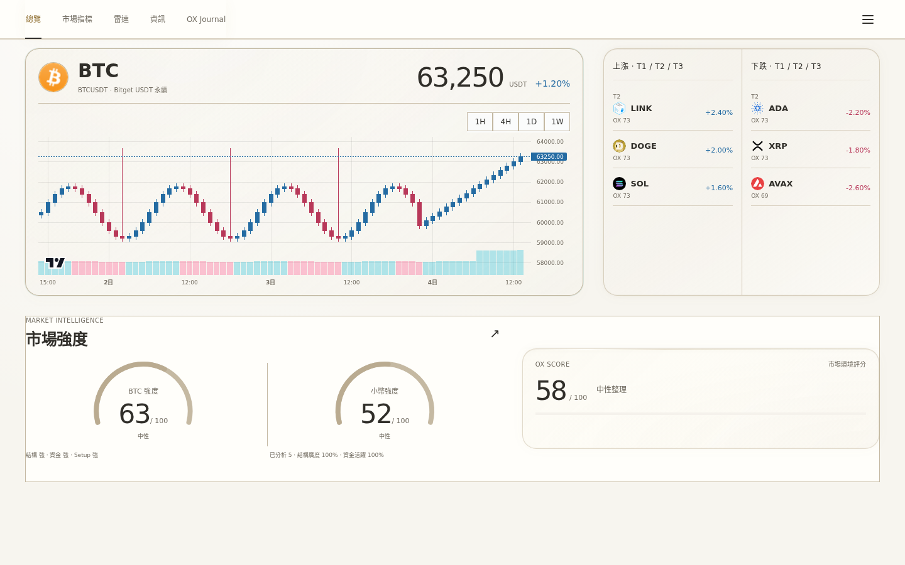
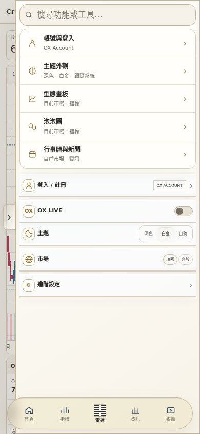
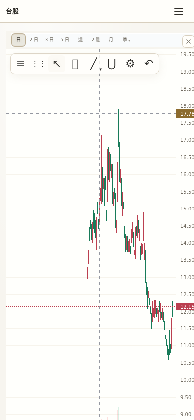
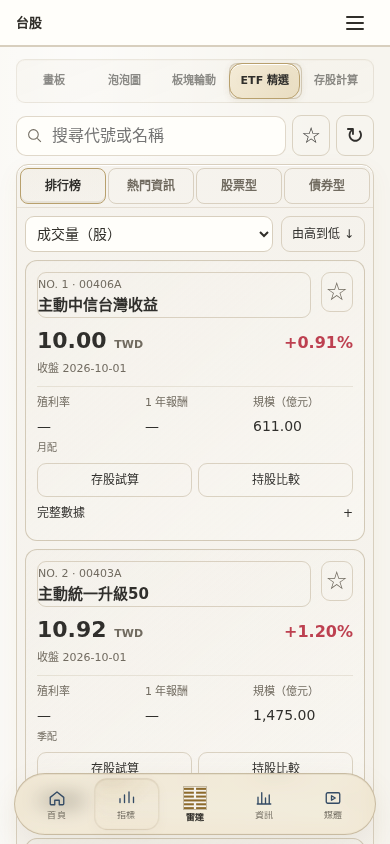
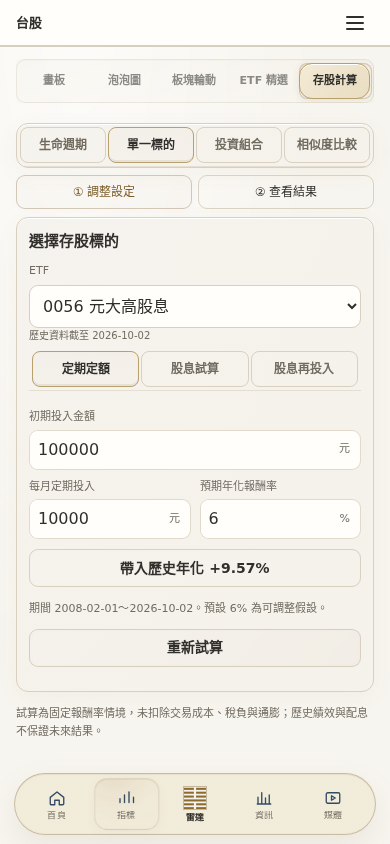
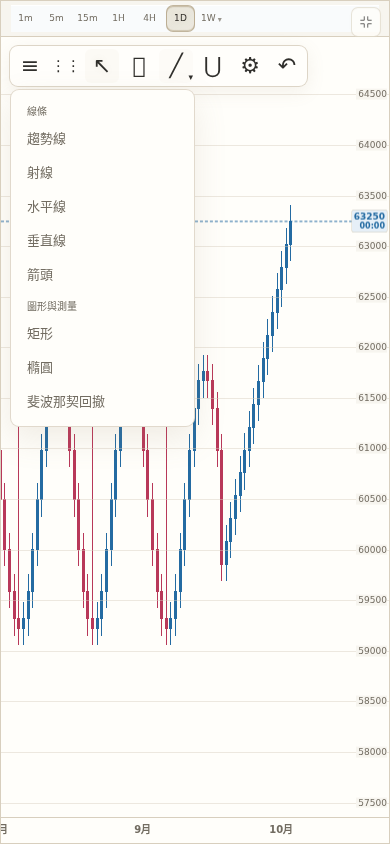

# 白金主題 2.0

白色主題原先混入舊版深色面板、搜尋入口與圖表配色。本次以暖白、香檳金、深灰文字統一加密與台股的頁面、工具、彈窗與展開狀態，並修復搜尋路由與圖表配色切換問題。

## 修改範圍

- 全站：導覽、主題設定、帳號選單、按鈕、輸入框、鍵盤焦點、通知及空資料狀態。
- 搜尋：改用線條圖示、清楚的功能分類與目前市場入口；ETF、存股、型態畫板能跨市場載入；支援方向鍵及 Escape。
- 加密與台股：圖表底色、座標軸、游標標籤、報價徽章、畫線選單、指標、週期與全螢幕工具。
- 指標工具：Shadow DOM、Canvas 與 SVG 都隨主題更新，涵蓋型態、泡泡、輪動、資金流、熱圖。
- 台股：ETF 全部分類、存股計算、風險／處置／解禁明細及選股器；漲跌仍維持台股紅漲綠跌，加密保留藍漲紅跌。
- 新聞：行事曆、篩選選單、閱讀偏好與展開內容。

以主分支 `75b7941` 為基礎，保留最新的兩市場產品範圍。

## 驗證紀錄（2026-10-04）

| 檢查 | 結果 |
| --- | --- |
| `npm test` | 415 / 415 通過 |
| `npm run check` | 96 個資源、171 個唯一 ID 通過 |
| 現有兩市場白金 UI 稽核 | Chromium，390 × 844 與 1440 × 900，共 225 個畫面狀態；0 大面積深色殘留、0 橫向溢出、0 執行期錯誤 |
| 主題切換 | 原生圖表不重建、不重設可視時間範圍；Shadow DOM 工具支援深色、白金、跟隨系統 |
| 搜尋 | 跨市場路由、延遲載入工具、鍵盤方向鍵與 Escape 通過 |

自動稽核會檢查目前可視區的背景與深色漸層、水平溢出、執行期錯誤，並留存截圖供人工檢視；它不是所有可能資料組合或每一個像素的保證。完整狀態清單見 [audit-summary.json](audit-summary.json)。

測試使用固定行情資料及儲存庫內的台股快照，實際載入 Lightweight Charts 4.2.3。這些畫面驗證介面與互動，不代表即時行情供應商驗收。

原有 `npm run test:e2e` 仍在 `tierCapacityRegression` 出現 `long: strict T1 capacity or exclusion failed`；相同瀏覽器在未修改的 `7bc6aba` 基準版本也重現。這次未修改分級規則或放寬該測試。Safari／WebKit 執行環境未能取得，因此手機結果是 Chromium 手機視窗，尚未在實機 Safari 驗證。

## 重跑

```bash
npm ci
npx playwright install chromium
npm run test:light-theme
```

預設沿用既有端對端測試的圖表替身。要驗證真正的原生圖表及保留可視範圍，設定 `OX_LWC_PATH` 指向 Lightweight Charts 4.2.3 standalone production bundle；`OX_BROWSER_PATH` 可指定 Chromium 執行檔。`OX_LIGHT_QA_OUT` 指定截圖與 JSON 輸出位置，`OX_LIGHT_WIDTHS`、`OX_LIGHT_MARKETS` 可縮小回歸範圍。

## 代表畫面

以下使用上述固定測試資料。

| 桌面首頁 | 手機搜尋 |
| --- | --- |
|  |  |

| 台股圖表與工具 | 台股 ETF |
| --- | --- |
|  |  |

| 存股計算 | 加密畫線選單 |
| --- | --- |
|  |  |

## 維護位置

`src/styles/themes/light-platinum.css` 定義白金色彩角色與共用控制項；`light-compat.css` 依來源檔案分段覆寫既有元件的顏色。各 Shadow DOM 工具使用相鄰的 `*-light.css`，由 `revealStyledShadow` 載入並同步主題。新增工具應一併提供淺色樣式，避免樣式尚未載入時顯示深色內容。
